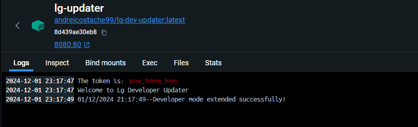

# LG Dev Session Updater

This is a simple .NET application that sends a request to the LG servers to extend the development session. The app is containerized and requires Docker to run.

## Prerequisites

1. **Install Docker**
   - Make sure Docker is installed on your PC. You can download it from [Docker's official website](https://www.docker.com/products/docker-desktop).
   - Verify the installation by running the following command in your terminal:
     ```bash
     docker --version
     ```

2. **Obtain an LG Developer Token**
   - You need a valid `LG_DEVELOPER_TOKEN` to use this application. Contact your LG development account administrator to obtain the token.

---

## Usage

Once Docker is installed and you have your developer token:

1. Open a terminal.
2. Run the following command, replacing `your_token_here` with your actual LG developer token:

   ```bash
   docker run -d --name=lg-updater -p 8080:80 -e LG_DEVELOPER_TOKEN=your_token_here andreicostache99/lg-dev-updater:latest
3. Go to the container named lg-updater and in the logs if the session was extended.
4. The script runs at every 10 days.


